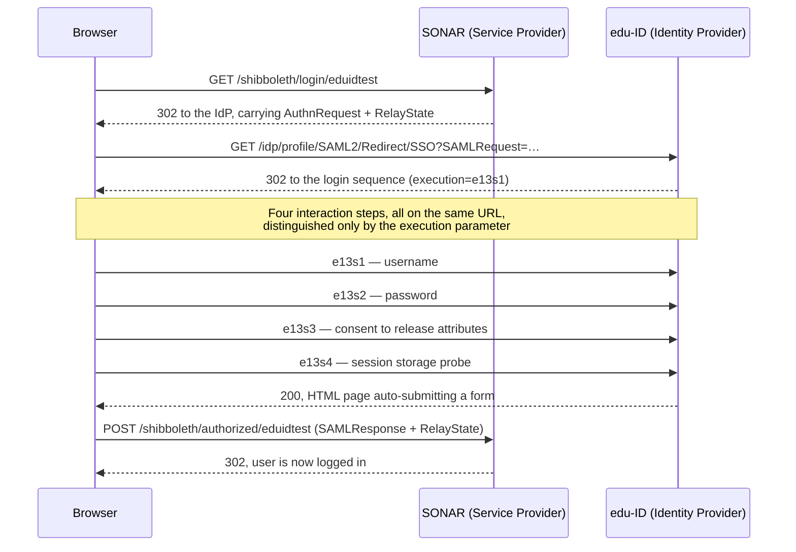
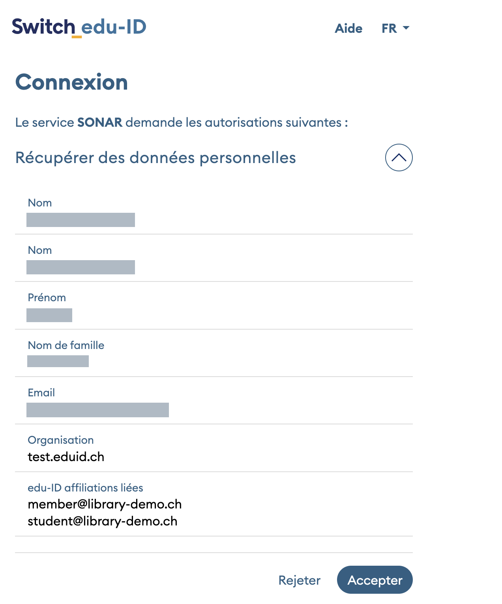

<!--
SPDX-FileCopyrightText: Fondation RERO+
SPDX-License-Identifier: AGPL-3.0-or-later
-->

# SWITCH edu-ID login flow

How a user signs in to SONAR through SWITCH edu-ID, step by step.

Every request below comes from a real capture of the test federation
(`login.test.eduid.ch`), taken with SAML-tracer against a development server on
`https://sonar.ch:5000`. Analytics and unrelated background traffic have been
removed; what remains is the complete flow, in order.

## Overview



## The steps

### 1. The user asks SONAR to sign in

```http
GET https://sonar.ch:5000/shibboleth/login/eduidtest
→ 302 https://login.test.eduid.ch/idp/profile/SAML2/Redirect/SSO?SAMLRequest=…&RelayState=…
```

Handled by `views/client.py::login`. It builds the SAML settings through
`auth.py::init_saml_auth`, then redirects the browser to the identity provider.
`eduidtest` is the provider key: it selects an entry of
`SHIBBOLETH_IDENTITY_PROVIDERS` and names the certificate file to trust.

### 2. The AuthnRequest reaches the identity provider

Sent with the **HTTP-Redirect binding**, so the request travels as URL
parameters: `SAMLRequest` (deflated then base64-encoded) and `RelayState`.
There is no `Signature` parameter — SONAR does not sign its authentication
requests.

```xml
<samlp:AuthnRequest
  ID="ONELOGIN_5201e5d3236ea7fdc93d081c9c2b71edfd8c2eb9"
  IssueInstant="2026-08-10T12:06:36Z"
  Destination="https://login.test.eduid.ch/idp/profile/SAML2/Redirect/SSO"
  ProtocolBinding="urn:oasis:names:tc:SAML:2.0:bindings:HTTP-POST"
  AssertionConsumerServiceURL="https://sonar.ch:5000/shibboleth/authorized/eduidtest">
    <saml:Issuer>https://sonar.ch/shibboleth</saml:Issuer>
    <samlp:NameIDPolicy
        Format="urn:oasis:names:tc:SAML:1.1:nameid-format:unspecified"
        AllowCreate="true" />
    <samlp:RequestedAuthnContext Comparison="exact">
        <saml:AuthnContextClassRef>urn:oasis:names:tc:SAML:2.0:ac:classes:PasswordProtectedTransport</saml:AuthnContextClassRef>
    </samlp:RequestedAuthnContext>
</samlp:AuthnRequest>
```

Three values decide whether the IdP accepts the request, and all three must
match the service registration in the Resource Registry:

| Element | Value | Where it comes from |
|---|---|---|
| `Issuer` | `https://sonar.ch/shibboleth` | `SHIBBOLETH_SERVICE_PROVIDER["entity_id"]` — an identifier, it never has to resolve |
| `AssertionConsumerServiceURL` | `https://sonar.ch:5000/shibboleth/authorized/eduidtest` | computed by `url_for(…, _external=True)`, so it follows the `Host` header |
| `Destination` | `https://login.test.eduid.ch/…` | the `sso_url` of the provider entry |

The `AssertionConsumerServiceURL` is the one that bites in practice: change the
hostname or the port of the development server and the IdP will reject the
request until the new URL is registered.

> **Certificates — none.** The outbound request is protected only by the TLS
> certificate of `login.test.eduid.ch`, which belongs to SWITCH. No SAML
> certificate is involved: the captured request carries `SAMLRequest` and
> `RelayState` and **no `SigAlg` or `Signature` parameter**, so SONAR does not
> sign it. The service provider key pair plays no part until the response comes
> back.
>
> This is a default rather than a decision: `init_saml_auth` declares no
> `security` section, so `python3-saml` applies `authnRequestsSigned: False`.
> Setting it to `True` covers the SONAR side, since the private key is already
> loaded. It is not sufficient on its own: the identity provider holds the
> certificate for *encryption*, and whether it accepts the same one to verify a
> signature depends on how the key is registered in the Resource Registry.
> Reusing a single certificate for both uses has to be agreed there. The gain is
> modest: the identity provider validates the
> `AssertionConsumerServiceURL` against the registered service, so a forged
> request cannot divert the assertion, and `RelayState` integrity is already
> covered by SONAR's own signed state token. Worth doing as defence in depth, on
> its own and not bundled with other work — a configuration mismatch would break
> login outright.

### 3. RelayState carries SONAR's own state

`RelayState` is opaque to the IdP, which returns it untouched. SONAR uses it to
remember what the user was doing. It is signed with `SECRET_KEY` through
`itsdangerous`, and decodes to:

```json
{
  "app": "eduidtest",
  "next": "https://sonar.ch:5000/login/?next=/",
  "sid": "60906f8a…d718f2a"
}
```

`sid` is a fingerprint of the browser session. On the way back,
`views/client.py` checks that it still matches and that `app` is the provider
being answered, which is what binds a response to the session that asked for it.

**That check is conditional.** It sits inside `if "RelayState" in request.form`,
so a response arriving without `RelayState` reaches `authorized_signup_handler`
unbound to any session. The identity provider always echoes the value back, so
this does not happen in the normal flow — but the protection is not
unconditional, and reading it as such would be wrong.

### 4. Authentication, in four steps on one URL

All four use the same URL and differ only by the `execution` parameter. Each is
a `GET` that renders a page, then a `POST` that submits it and redirects to the
next.

| execution | Page | POST fields |
|---|---|---|
| `e13s1` | Username | `j_username`, `_eventId_submit` |
| `e13s2` | Password | `j_username`, `j_password`, `_eventId_proceed` |
| `e13s3` | **Attribute consent** | `_shib_idp_consentIds` (one per attribute), `_eventId_proceed=Accepter` |
| `e13s4` | Session storage probe | `shib_idp_ls_success.shib_idp_session_ss`, `_eventId_proceed` |

Step `e13s4` is not a user interaction. The page reads
`/idp/profile/user/system/shared-local-storage` to look for an existing single
sign-on session in the browser, then submits by itself. In the capture the probe
comes back empty — `shib_idp_ls_success.shib_idp_session_ss = false` — which is
expected on a first login. The `_ss` suffix names the browser's `sessionStorage`,
and `shib_idp_ls_success.<key>` is how the page reports back whether the read
worked.

What this stores is the **identity provider's own SSO session**, so that signing
in to a second service in the same browser does not ask for credentials again.
It lives in the browser, disappears when the browser closes, and writes nothing
to the edu-ID account. Do not confuse it with the consent of step `e13s3`, which
is the durable record of the user–service pair.

### 5. Consent — what the user is actually asked

Step `e13s3` is where the user authorises the release of each attribute. The
`_shib_idp_consentIds` fields submitted match one for one what the page lists:

```text
commonName  displayName  givenName  surname  email
swissEduPersonHomeOrganization  swissEduIDLinkedAffiliation
```



*Name and e-mail are redacted; the home organisation and the linked affiliations
are the values this flow exists to obtain.*

Consent is stored by the identity provider for the user–service pair, and it is
durable: the page is shown on the first login, then only again if one of the
released values has changed since — or if the user has asked to be prompted at
every login. It survives browser restarts, unlike the SSO session of step
`e13s4`.

That matters when testing. Widen the attribute set in the Resource Registry and
you may see no difference, because the stored consent still covers the previous,
narrower set. To force the page back, tick the box offered on the login page to
revoke previous consent; edu-ID administrators can also reset it for a given
service or user.

### 6. The response returns by POST

The IdP answers step `e13s4` with an HTML page containing a form that submits
itself to the assertion consumer service:

```http
POST https://sonar.ch:5000/shibboleth/authorized/eduidtest
  SAMLResponse=…   (11 829 bytes once base64-decoded)
  RelayState=…     (returned unchanged)
→ 302 https://sonar.ch:5000/login/?next=/
```

This is why the development server needs a certificate the browser trusts. The
POST is issued by a page served from `login.test.eduid.ch`; if the browser
raises a certificate warning on `sonar.ch:5000`, clicking through generally
drops the request body, and the assertion is lost.

The response is **signed**, and the assertion inside it is **encrypted** to
SONAR's service provider certificate:

```xml
<saml2p:Response Destination="https://sonar.ch:5000/shibboleth/authorized/eduidtest" …>
  <saml2:Issuer>https://test.eduid.ch/idp/shibboleth</saml2:Issuer>
  <ds:Signature>…</ds:Signature>
  <saml2p:Status>
    <saml2p:StatusCode Value="urn:oasis:names:tc:SAML:2.0:status:Success"/>
  </saml2p:Status>
  <saml2:EncryptedAssertion>…</saml2:EncryptedAssertion>
</saml2p:Response>
```

There is no readable `AttributeStatement` in the POST body: the attributes only
appear after `python3-saml` decrypts the assertion.

> **Certificates — three at once, and this is the densest moment of the flow.**
>
> - The **TLS certificate of the development server** protects the POST. It is
>   the only one the browser checks, and the only one that has to be *trusted*
>   rather than merely known — see the warning above about losing the body.
> - The IdP signed the response with its private key. SONAR verifies that
>   signature against **`data/idp_certificates/eduidtest.crt`**, the copy of the
>   IdP signing certificate published in the SWITCH federation metadata.
> - The IdP encrypted the assertion with **SONAR's service provider
>   certificate**, which it holds from the Resource Registry registration. The
>   captured `EncryptedKey` names it explicitly:
>   `Recipient="https://sonar.ch/shibboleth"`.
>
> Note the asymmetry: the IdP certificate is a *trust anchor* and is legitimately
> versioned in the repository, whereas the service provider key pair is a secret
> provisioned per environment.

**The `Issuer` must equal the identity provider's configured `entity_id`** —
that is `SHIBBOLETH_IDENTITY_PROVIDERS["eduidtest"]["entity_id"]`, not the
service provider's `SHIBBOLETH_SERVICE_PROVIDER["entity_id"]` seen in step 2.
The two are easy to confuse: the first identifies edu-ID and is what the
response and assertion `Issuer` are compared against; the second identifies
SONAR and is what the `AuthnRequest` carries. `python3-saml` rejects any
mismatch. It stays `https://test.eduid.ch/idp/shibboleth` only because the
service requires the *private identity*; were the affiliation identity allowed,
the answer would come from the institution's own IdP
(`https://aai-login.<institution>.eduid.ch/idp/shibboleth`) and validation would
fail.

### 7. Attributes, once decrypted

> **Certificate — the service provider private key, and the order matters.**
> `python3-saml` decrypts as soon as the response object is built, *before* any
> validation: `OneLogin_Saml2_Response.__init__` sees the `EncryptedAssertion`
> and calls `_decrypt_assertion`, which uses `get_sp_key()` — that is
> `SHIBBOLETH_SERVICE_PROVIDER_PRIVATE_KEY`. Validation comes next, in `is_valid`:
> a signature on the response is checked against the original document, one on
> the assertion against the decrypted one, both with the same IdP certificate.
>
> The practical consequence: a wrong or missing private key fails at
> construction, with a decryption error, never with a signature error. If you
> see "Signature validation failed", suspect the IdP certificate; if you see a
> decryption failure, suspect the service provider key pair.

```text
urn:oid:2.16.840.1.113730.3.1.241  displayName                     Camille Dupraz
urn:oid:2.5.4.3                    commonName                      Camille Dupraz
urn:oid:2.5.4.4                    surname                         Dupraz
urn:oid:2.5.4.42                   givenName                       Camille
urn:oid:0.9.2342.19200300.100.1.3  mail                            camille.dupraz@example.org
urn:oid:2.16.756.1.2.5.1.1.1       swissEduPersonUniqueID          0000159046867193@test.eduid.ch
urn:oid:1.3.6.1.4.1.5923.1.1.1.6   eduPersonPrincipalName          0000159046867193@test.eduid.ch
urn:oid:1.3.6.1.4.1.5923.1.1.1.13  eduPersonUniqueId               0000159046867193@test.eduid.ch
urn:oid:2.16.756.1.2.5.1.1.4       swissEduPersonHomeOrganization  test.eduid.ch
urn:oid:2.16.756.1.2.5.1.1.1029    swissEduIDLinkedAffiliation     member@library-demo.ch
                                                                   student@library-demo.ch
```

`handlers.py::authorized_signup_handler` reads them through
`utils.py::get_account_info`, which keeps three of them — the ones named in the
`mappings` of the provider entry.

Two are worth a closer look.

**`swissEduPersonHomeOrganization` is `test.eduid.ch`**, not a university. That
is the signature of the private identity: the home organisation is edu-ID
itself. The same holds for the scope of the unique identifier, which is why that
identifier stays stable even if the person changes institution.

**`swissEduIDLinkedAffiliation` lists every current affiliation**, as
`<role>@<scope>` pairs. Here the same institution appears twice, once as
`member` and once as `student` — the specific role always comes alongside
`member`.

**SONAR requests this attribute but does not yet consume it.** `sonar/config.py`
maps only `email`, `full_name` and `user_unique_id`, and `get_account_info`
keeps nothing else, so the affiliations are released and dropped. Whoever adds a
membership check should look for a *pair*, never ask “what is this person's
role”: one institution yields several values, and the specific role always comes
with `member`.

### 8. Back on SONAR

```http
GET  https://sonar.ch:5000/login/?next=/   → 302 /
GET  https://sonar.ch:5000/               → 200
```

By this point the account exists and the session is open.
`authorized_signup_handler` has found the user by e-mail, created the account if
needed, linked the external identity, and authenticated the session.

The link is a `UserIdentity` row, written by `oauth_link_external_id` with
`method` set to the provider key. It is what lets a returning user be recognised
even after changing their e-mail address.

**It does not appear under `/account/settings/linkedaccounts/`.** That page
enumerates `OAUTHCLIENT_REMOTE_APPS`, where SONAR declares only ORCID; this
module borrows a few helpers from invenio-oauthclient but never registers itself
as a remote app — it is SAML, not OAuth. So the link is recorded and invisible:
users can unlink ORCID, but not edu-ID.

That is defensible rather than accidental. Unlinking ORCID loses an enrichment,
whereas unlinking edu-ID would lock the user out, since an account created
through SAML has no local password. The absence of a control protects as much as
it limits.

## Which certificate does what

Four certificates take part, and they are easy to confuse because two of them
answer to the name "SONAR". Every public part is published somewhere — in
federation metadata, in the Resource Registry, or presented during a TLS
handshake. Only the private keys stay on their respective servers.

| Certificate | Who holds the private key | Used for | At step |
|---|---|---|---|
| **Development server TLS** — `.certs/dev.crt` + `.certs/dev.key` | SONAR | Serving `https://sonar.ch:5000`. Validated by the browser, and the one that has to be *trusted* rather than merely present — the return POST is lost otherwise. | 1, 6, 8 |
| **`login.test.eduid.ch` TLS** | SWITCH | Serving the identity provider. Also validated by the browser, but publicly trusted, so nothing to configure. | 2 – 5 |
| **Service provider key pair** — `SHIBBOLETH_SERVICE_PROVIDER_CERTIFICATE` / `_PRIVATE_KEY` | SONAR | The **public part**, registered in the Resource Registry, is what the IdP encrypts the assertion to. The **private part** decrypts it. Not used to sign in the current configuration, since SONAR does not sign its requests. | 6 (encryption), 7 (decryption) |
| **Identity provider signing certificate** — `data/idp_certificates/<provider>.crt` | SWITCH | Verifying the signature of the response. A trust anchor: without it, a forged response would be accepted. | 6 |

Two distinctions worth holding on to.

**TLS and SAML are independent layers.** TLS protects the hop; SAML protects the
message. A perfectly valid TLS session tells you nothing about who issued the
assertion, and the SAML signature stays valid whatever happens to the transport.
They fail separately and for different reasons.

**Public and secret are inverted between the two SAML certificates.** The
identity provider certificate is *meant* to be distributed — SWITCH publishes it
in the federation metadata, and it is legitimately versioned in this repository.
The service provider certificate is public too, but its key is not: the pair is
provisioned per environment, outside the repository, and its public part has to
be registered with SWITCH before anything works.

## Where the identity provider certificates come from

`data/idp_certificates/<provider>.crt` is a copy of what SWITCH publishes in the
federation metadata. That aggregate is the authoritative source: whenever an
identity provider rotates its signing key, this is where the new certificate
appears.

| Federation | Aggregate for service providers | Identity provider entityID | Local file |
|---|---|---|---|
| Test | `https://metadata.aai.switch.ch/metadata.aaitest+idp.xml` | `https://test.eduid.ch/idp/shibboleth` | `eduidtest.crt` |
| Production | `https://metadata.aai.switch.ch/metadata.switchaai+idp.xml` | `https://eduid.ch/idp/shibboleth` | `eduid.crt` |

Use the `+idp` aggregates rather than the legacy `metadata.aaitest.xml` and
`metadata.switchaai.xml`: they hold only identity providers, which is all a
service provider needs, and they are an order of magnitude smaller — 271 KB
against 2.5 MB for the test federation, 1.4 MB against 21 MB for production.

To refresh a certificate, pull the `KeyDescriptor use="signing"` of the matching
`EntityDescriptor`. The repository stores it as bare base64, without the PEM
header lines and wrapped at 64 columns — `python3-saml` adds the headers itself.
Two details cost an afternoon each if missed: the file must end with a newline,
and no line may carry trailing spaces.

Verify what you extracted before replacing anything:

```shell
openssl x509 -inform DER -in <extracted>.der -noout -subject -dates -fingerprint -sha256
```

Both files currently in the repository match their published counterparts
exactly, checked by SHA-256 of the DER.

The aggregates are themselves signed, with a certificate chaining to the
Switch edu-ID Root CA — see the [SWITCH PKI repository](https://help.switch.ch/pki/aai/).
Verifying that signature is the rigorous way to trust an extraction; fetching
over HTTPS from `metadata.aai.switch.ch` and comparing fingerprints is the
pragmatic one.

## Configuration this flow depends on

**In the Resource Registry** — <https://rr.aai.switch.ch/menu_res_options.php> —
where the SONAR service is administered. The same registry serves both
federations; each resource carries its own environment, so the test service and
the production one are edited separately and approved separately.

The service must require the **private identity** together with the *edu-ID
linked affiliation* attribute. Those two go together:
`swissEduIDLinkedAffiliation` is only released with the private identity, and
requiring the private identity is also what keeps the `Issuer` constant.
Declaring the attribute alone gets the request rejected — which is exactly how
the first attempt was answered.

The *Identity Selection* preference — "ask if personal or affiliation identity
should be used" — must stay off. It permits the affiliation identity, which is
exactly what breaks the flow.

The **intended audiences** must be narrowed to match. The registration authority
asked for this explicitly on the second review: the other home organisation
types are to be marked as *excluded*, leaving only the private identity. The
vocabulary of `swissEduPersonHomeOrganizationType` has eight values, so eight
decisions to make:

| Value | Meaning |
|---|---|
| `university` | University or federal institute of technology |
| `uas` | University of applied sciences, or university of teacher education |
| `hospital` | Hospital |
| `library` | Library |
| `tertiaryb` | Professional education and training college (tertiary B) |
| `uppersecondary` | Vocational or general education school, upper secondary |
| `vho` | Virtual home organisation |
| `others` | None of the above |

Leaving them open would contradict the identity requirement: a user arriving
with a university affiliation would match an intended audience the service
cannot in fact serve, since that path releases neither the linked affiliation
nor a stable identifier. Excluding them makes the registration say what the
service actually does — everyone signs in with their private edu-ID, and
affiliations arrive as attributes rather than as an identity.

Every change here goes through approval by the registration authority, so plan
for a round trip. Group edits rather than submitting them one at a time: a new
assertion consumer service URL and an attribute requirement, for instance, cost
one wait together and two separately.

**In SONAR**, three settings and one file per provider:

| | |
|---|---|
| `SHIBBOLETH_SERVICE_PROVIDER["entity_id"]` | must match the registered service |
| `SHIBBOLETH_SERVICE_PROVIDER_CERTIFICATE` / `_PRIVATE_KEY` | the key pair the assertion is encrypted to; provided per environment, never versioned |
| `SHIBBOLETH_IDENTITY_PROVIDERS[<key>]` | `entity_id`, `sso_url` and the attribute `mappings` |
| `data/idp_certificates/<key>.crt` | the identity provider signing certificate, published in the SWITCH federation metadata |

## How to test

### Give the test account an affiliation

This is the step that is easy to miss, and it invalidates every other test until
it is done. A fresh edu-ID account has a personal identity and nothing else, so
`swissEduIDLinkedAffiliation` has nothing to carry — the attribute is then
missing from the assertion entirely, even once the Resource Registry allows it.
Two causes, one symptom, and they are easy to confuse.

Add an organisational identity from the account itself:

- Test federation — <https://test.eduid.ch/account/organisations>
- Production — <https://eduid.ch/account/organisations>

The page offers **Add an organisation identity**, which links you to an existing
one, and **Create an organisational identity yourself**. On the test federation,
the first lists a set of demo identity providers:

```text
Demo Home Organisation     Demo Others              Demo Tertiaryb
Demo Hospital              Demo Partner University  Demo UAS
Demo Library               Demo University
```

That list is not arbitrary: it mirrors the `swissEduPersonHomeOrganizationType`
vocabulary documented above, one demo provider per type.

Do not expect linking one of them to demonstrate that an excluded organisation
type is refused. With the private identity required, the affiliation chooser
never appears and the user always authenticates with their personal edu-ID,
whatever they are linked to. Linking `Demo University` simply adds another
`<role>@<scope>` value to the released list. What the demo providers let you
vary is the **content** of `swissEduIDLinkedAffiliation`, not the identity the
assertion is issued for.

The account used throughout this document is linked to **Demo Library**, which
yields the scope `library-demo.ch` — hence `member@library-demo.ch` and
`student@library-demo.ch`. Note that one institution produces two values: the
specific role and `member`.

### Check the prerequisites

Four things must hold, and each fails in its own recognisable way.

| Requirement | How it fails when missing |
|---|---|
| `SHIBBOLETH_SERVICE_PROVIDER_CERTIFICATE` and `_PRIVATE_KEY` set in `invenio.cfg` | No SWITCHaai button at all — `get_switch_aai_providers()` returns an empty list, so the login page hides it |
| `APP_ENV=development` | The button appears but `eduidtest` is absent from it: providers flagged `dev` are filtered outside development |
| A development certificate covering the hostname, and **trusted** | Login runs to the end, then the browser warns on the return POST and the assertion is lost with the request body |
| The assertion consumer service URL registered in the Resource Registry | The identity provider refuses the request before any page is shown |

### Run it

```shell
APP_ENV=development uv run poe server
```

Open `https://sonar.ch:5000`, choose the SWITCHaai provider, and follow the four
identity provider steps. The consent page of step 5 should list *edu-ID linked
affiliations* among the attributes; if it does not, the Resource Registry
declaration is the place to look, not the code.

### When nothing seems to change

The three causes, in the order worth checking:

- **The consent page no longer appears, and the attribute is still absent.**
  Stored consent covers the previous, narrower attribute set. Tick the box on the
  login page to revoke it, then sign in again.
- **The consent page lists the attribute but the assertion does not carry it.**
  The account has no affiliation — go back to the account page above.
- **Nothing at all reaches SONAR.** Look at the browser rather than the server:
  a certificate warning on the return POST swallows the assertion silently, and
  the server logs show nothing because no request ever arrived.

## If this module ever becomes costly: the OpenID Connect path

edu-ID speaks OpenID Connect as well as SAML, from the same Shibboleth identity
provider. This section records what was established while documenting the SAML
integration, so that the option can be evaluated later without redoing the
research. **It is not a plan.** Nothing here justifies migrating today.

### What would trigger a look

- A certificate rotation that goes wrong, or the per-environment provisioning of
  the service provider key pair becoming a recurring cost.
- SWITCH announcing a deprecation date for SAML. As of August 2026 there is
  none.

### Where things stood in August 2026

SWITCH publishes a governance RFC on the OIDC identity model — published
1 February 2026, final specification 21 July 2026 — whose purpose is precisely to
release **organisational identities** through OIDC, which until then carried only
the extended identity model. Its motivation is stated plainly: *“SAML is not
actively developed anymore and lacks support for use cases like mobile or
single-page applications or OAuth 2.0.”*

There is, however, **no deprecation statement and no timeline**. The service
documentation presents both protocols as supported, and notes that OIDC support
“is currently limited compared to SAML”. Read that RFC first: it describes how
the affiliation model this module depends on maps onto OIDC claims.

### What the integration would look like

Discovery documents are published on both federations —
`https://login.eduid.ch/.well-known/openid-configuration` and its
`login.test.eduid.ch` counterpart. The endpoints follow the Shibboleth layout
(`/idp/profile/oidc/authorize`, `/token`, `/userinfo`, `/keyset`), not the
Keycloak one.

`scopes_supported` advertises both `https://login.eduid.ch/authz/User.Read`,
which the attribute specification ties to `swissEduIDLinkedAffiliation`, and the
newer `https://eduid.ch/scope/userinfo.read`. Check which one SWITCH expects
before using either — the affiliations this module exists to read are reachable
as an OIDC claim through one of them.

The integration point would be `OAUTHCLIENT_REMOTE_APPS`, alongside ORCID, using
`OAuthSettingsHelper` with explicit endpoint URLs. Three cautions:

- **The Keycloak contrib is not reusable as is.** Despite looking like a generic
  OIDC helper, it derives endpoints from Keycloak's URL scheme and fetches the
  signing key from a realm URL rather than a `jwks_uri`.
- **Audience verification is off by default.** In
  `contrib/keycloak/helpers.py`, `_VERIFY_AUD` defaults to `False`. Binding the
  ID token to the client is the property that makes OIDC an authentication
  protocol rather than a bearer-token scheme; leaving it off reproduces the
  weakness OIDC was designed to fix.
- **The registration cost does not disappear.** OIDC services are registered
  through the same Resource Registry, with the same approval cycle, scopes
  standing in for attribute declarations.

### The trade

Gone: the service provider key pair to provision and rotate per environment, the
identity provider certificate tracked in `data/idp_certificates/`, and the XML
signature and encryption stack. Four certificates become client credentials —
either a client secret or, since `token_endpoint_auth_methods_supported`
advertises `private_key_jwt`, a registered public key, which trades one key pair
for another rather than removing it.

Added: rewriting the login path, the handler and the attribute mapping;
re-registering both services; and either a period running two mechanisms or a
flag day.

## Reproducing a capture

Install [SAML-tracer](https://addons.mozilla.org/firefox/addon/saml-tracer/),
sign in, then export. Two cautions:

- **The export contains the password in clear text**, in the `j_password` field
  of the `e13s2` step, along with the e-mail address and the full assertion.
  Treat an export as a credential: keep it out of the repository, and change the
  password of any account whose capture was shared.
- Capture in a private window, or the export will be buried under unrelated
  traffic from your other tabs — the original had 62 requests, of which 45 came
  from an open webmail.
